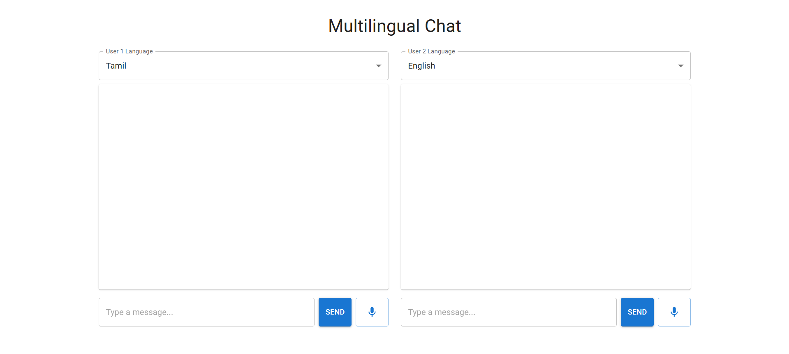

# Real-time Multilingual Chat

This is a real-time multilingual chat application supporting 10 Indian languages. Users can communicate through text or voice input, with automatic translation happening instantly. The split-panel interface shows both original messages and translations, creating a seamless conversation experience across language barriers. Perfect for multilingual teams and international communication.

## Features

This is a real-time multilingual chat application that enables seamless communication between users speaking different languages. The application supports 10 Indian languages including English, Hindi, Tamil, Telugu, Marathi, Gujarati, Bengali, Kannada, Malayalam, and Punjabi. Users can communicate through text or voice input, with automatic translation happening in real-time. The chat interface is split into two panels, allowing users to see both the original message and its translation. The application features a modern, responsive design with intuitive controls for language selection, text input, and voice recording. Built with real-time capabilities using Socket.IO, messages are instantly delivered and translated, creating a smooth and natural conversation experience across language barriers.

## Tech Stack

*   Frontend: React, Material-UI, TypeScript
*   Backend: Node.js, Express
*   Real-time: Socket.IO
*   Translation: Google Cloud Translation API
*   Speech: Web Speech API

## Interface

Here's a glimpse of the application interface:




## Prerequisites

- Node.js (v14 or higher)
- npm or yarn
- Google Cloud account with Translation API enabled

## Setup

1. Clone the repository:
```bash
git clone <repository-url>
cd multilingual-chat
```

2. Install backend dependencies:
```bash
npm install
```

3. Install frontend dependencies:
```bash
cd client
npm install
```

4. Create a `.env` file in the root directory with your Google Cloud credentials:
```
GOOGLE_CLOUD_PROJECT_ID=your-project-id
GOOGLE_APPLICATION_CREDENTIALS=path/to/your/credentials.json
PORT=5000
```

5. Start the backend server:
```bash
npm run dev
```

6. In a new terminal, start the frontend development server:
```bash
cd client
npm start
```

The application will be available at `http://localhost:3000`

## Usage

1. Open the application in two different browser windows to simulate two users
2. Each user can select their preferred language from the dropdown menu
3. Type messages in your preferred language
4. Messages will be automatically translated to the receiver's preferred language

## Supported Languages

- English (en)
- Hindi (hi)
- Tamil (ta)
- Telugu (te)
- Marathi (mr)
- Gujarati (gu)
- Bengali (bn)
- Kannada (kn)
- Malayalam (ml)
- Punjabi (pa)

## Technologies Used

- React
- TypeScript
- Material-UI
- Socket.IO
- Express.js
- Google Cloud Translation API 
